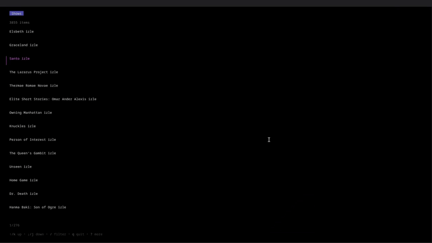

# dizi-cli 

[](https://github.com/gocolly/colly)
[](https://github.com/chromedp/chromedp)

A cli tool for watching TV shows directly from your terminal. Built with Go using Colly for web scraping and ChromeDP for headless browsing.Scraping some **pirated** show sites and watching them from your terminal.

**Disclaimer**: This project is for educational purposes only. Use it at your own risk. I do not endorse or support piracy.İ just made this to learn more about go and web scraping.

## Features ✨
<div style="display: flex; flex-wrap: wrap; gap: 20px; justify-content: center">
  <div style="width: 48%">
    
    <p align="center"><b>Search and select shows</b></p>
  </div>
  <div style="width: 48%">
    
    <p align="center"><b>Search and select seasons and episodes</b></p>
  </div>
  <div style="width: 100%; max-width: 800px">
    
    <p align="center"><b>Stream the chosen episode</b></p>
  </div>
</div>

## Installation ⚙️
### releases
You can get the precompiled version from the releases tab.
### Build From Source
#### Prerequisites
- Go 1.16+
- Chrome/Chromium browser

```bash
# Clone the repository
git clone https://github.com/ahmet1hekim/dizi-cli.git
cd dizi-cli

# Install dependencies
go get github.com/gocolly/colly/v2
go get github.com/chromedp/chromedp

# Build and install
go build -o dizi-cli
sudo mv dizi-cli /usr/local/bin/
